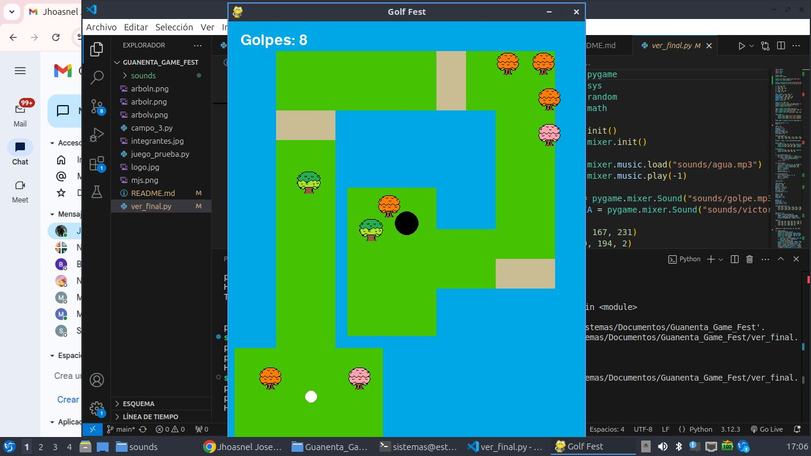
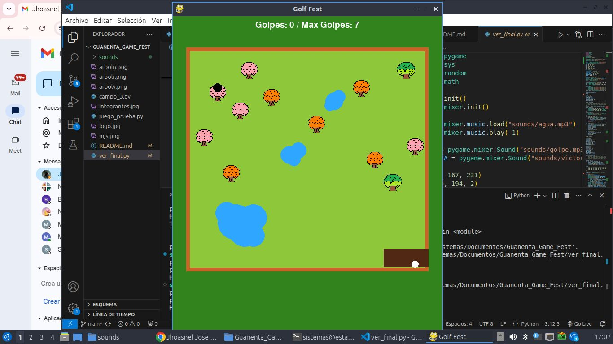

# GOLF FEST

## Integrantes:
- Mariangel Ortegate
- Jhoasnel Méndez
- Sofia Galviz

## ¿En qué consiste?

Nuestro juego de golf se basa en la modalidad clásica, en la que los jugadores deben introducir una pelota en una serie de hoyos distribuidos a lo largo de un campo, utilizando la menor cantidad de golpes posible. Cada jugador comienza desde un tee de salida y debe superar diversos obstáculos, con el objetivo de lograr puntuaciones como birdie o bogey. Es un juego que exige precisión, estrategia y control.

### ¿Cómo Jugarlo?
Para disfrutar plenamente de la funcionalidad de nuestro juego, es importante analizar bien el campo antes de comenzar. Ten en cuenta que encontrarás diversos obstáculos, y si no logras superarlos, deberás regresar al inicio. Controla la pelota con el cursor del mouse, y recuerda: la fuerza del lanzamiento dependerá completamente de ti.

### Niveles
Este juego consta de 2 niveles que deberas pasar superando los obstáculos y llegando hasta el hoyo.

#### Primer Nivel
- El primer nivel consta de un campo en medio del agua, el mayor obstáculo en este campo es lograr pasarlo sin que la pelota toque el agua, tambièn te encontraràs con arboles que rebotaràn tu pelota con el fin de no dejarte llegar a la meta y con arena reductora de velocidad.

#### Segundo Nivel
- Si lograste pasar el nivel anterior, este realmente es más sencillo, solo debes pasar los árboles que haràn que tu pelota rebote, posterior al rebote desapareceran haciendo que el camino se despeje y sea màs fàcil con cada tiro dado llegar hasta el hoyo.

